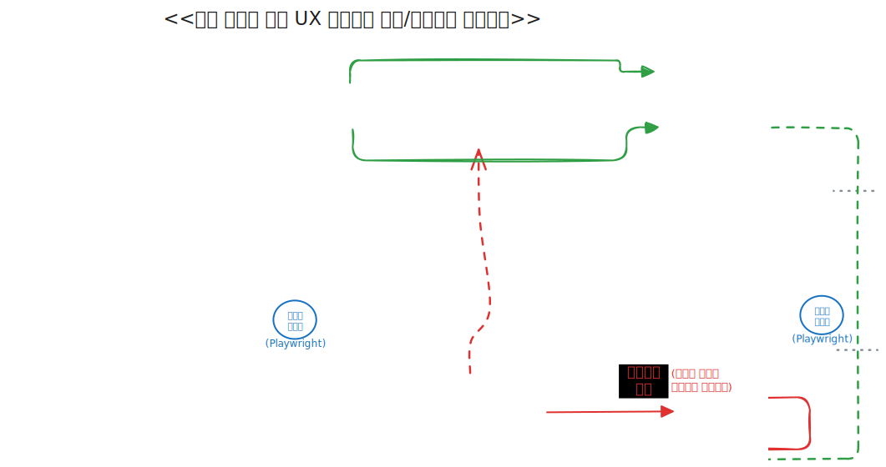
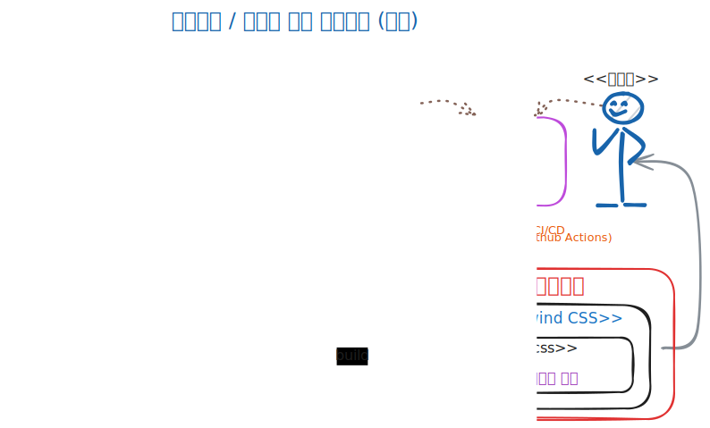

<style>

@font-face {
    font-family: 'Pretendard-Regular';
    src: url('https://fastly.jsdelivr.net/gh/Project-Noonnu/noonfonts_2107@1.1/Pretendard-Regular.woff') format('woff');
    font-weight: 400;
    font-style: normal;
}

@font-face {
    font-family: 'SUIT-Regular';
    src: url('https://fastly.jsdelivr.net/gh/projectnoonnu/noonfonts_suit@1.0/SUIT-Regular.woff2') format('woff2');
    font-weight: normal;
    font-style: normal;
}

@font-face {
    font-family: 'NanumSquareNeoLight';
    src: url(https://hangeul.pstatic.net/hangeul_static/webfont/NanumSquareNeo/NanumSquareNeoTTF-aLt.eot);
    src: url(https://hangeul.pstatic.net/hangeul_static/webfont/NanumSquareNeo/NanumSquareNeoTTF-aLt.eot?#iefix) format("embedded-opentype"), url(https://hangeul.pstatic.net/hangeul_static/webfont/NanumSquareNeo/NanumSquareNeoTTF-aLt.woff) format("woff"), url(https://hangeul.pstatic.net/hangeul_static/webfont/NanumSquareNeo/NanumSquareNeoTTF-aLt.ttf) format("truetype");
}

@font-face {
    font-family: 'NanumSquareNeo';
    src: url(https://hangeul.pstatic.net/hangeul_static/webfont/NanumSquareNeo/NanumSquareNeoTTF-bRg.eot);
    src: url(https://hangeul.pstatic.net/hangeul_static/webfont/NanumSquareNeo/NanumSquareNeoTTF-bRg.eot?#iefix) format("embedded-opentype"), url(https://hangeul.pstatic.net/hangeul_static/webfont/NanumSquareNeo/NanumSquareNeoTTF-bRg.woff) format("woff"), url(https://hangeul.pstatic.net/hangeul_static/webfont/NanumSquareNeo/NanumSquareNeoTTF-bRg.ttf) format("truetype");
}

@font-face {
    font-family: 'NanumSquareNeoBold';
    src: url(https://hangeul.pstatic.net/hangeul_static/webfont/NanumSquareNeo/NanumSquareNeoTTF-cBd.eot);
    src: url(https://hangeul.pstatic.net/hangeul_static/webfont/NanumSquareNeo/NanumSquareNeoTTF-cBd.eot?#iefix) format("embedded-opentype"), url(https://hangeul.pstatic.net/hangeul_static/webfont/NanumSquareNeo/NanumSquareNeoTTF-cBd.woff) format("woff"), url(https://hangeul.pstatic.net/hangeul_static/webfont/NanumSquareNeo/NanumSquareNeoTTF-cBd.ttf) format("truetype");
}

@font-face {
    font-family: 'NanumSquareNeoExtraBold';
    src: url(https://hangeul.pstatic.net/hangeul_static/webfont/NanumSquareNeo/NanumSquareNeoTTF-dEb.eot);
    src: url(https://hangeul.pstatic.net/hangeul_static/webfont/NanumSquareNeo/NanumSquareNeoTTF-dEb.eot?#iefix) format("embedded-opentype"), url(https://hangeul.pstatic.net/hangeul_static/webfont/NanumSquareNeo/NanumSquareNeoTTF-dEb.woff) format("woff"), url(https://hangeul.pstatic.net/hangeul_static/webfont/NanumSquareNeo/NanumSquareNeoTTF-dEb.ttf) format("truetype");
}

h1, h2 {
font-family: NanumSquareNeoExtraBold
}

p:has(img) {
   text-align: center;
}

iframe {  border: 1px solid silver; zoom: 100%; height: 100%; }

section {
  padding-top: 50px;
  user-select: none;
  font-family: NanumSquareNeo, sans-serif;
  font-size: 1.8rem;
  letter-spacing: 0.5px;
  display: flex;
  flex-direction: column;
  justify-content: start;
}
</style>

<style scoped> * { text-align: center } section { justify-content: center; } </style>

# DSDS 컴포넌트 개발 라이브리리 소개

## **김용기**, 조무영

<{yongki82.kim, mercy.cho}@samsung.com>

### 2025. 6. 12

---

# Agenda

- UI 컴포넌트 개발 개요 일정 목표 (지원 Tier 1, 2)
	- 최종: ~7/31, 1차: ~5/31, 2차: ~6/30
- UI 컴포넌트 개발 거버넌스 / 프로세스
	- 디자이너 / 개발자간 협업 혁신 방법 (Demo)
- 구현 대상 목록 및 상세 개발 일정 / 진행사항
- 도움이 필요한 사항
- Q&A

---

<style scoped> section { justify-content: center; } </style>

# 1. Overview

---

# Overview

## 목표

- MES 내 UM 과제에서 공통적으로 활용할 UI 컴포넌트 라이브러리의
- 거버넌스 및 개발 프로세스를 확립하고
- 필요한 핵심 / 공통 컴포넌트를 7월 말까지 단계적으로 구현 / 배포합니다.

---

# Overview
## 진행 일정
**총 20개 디자인 항목을 7월 말까지 개발 및 배포**

* **(~5/30) 기초 컴포넌트 완료:** Buttons, Boxes (Calendar 제외), Checkbox, Dropdown, Radio, Modal, Tab, Toggle, Tooltip,
* **(~6/30) 추가 컴포넌트 완료:** Badge, Boxes(Calendar), Header, Footer, Pagination, Popover, Spinner, Tag, Toast, Toggletip
* **(~7/30) 고급 컴포넌트 및 추가 요청사항 반영:** Form, LNB, 및 추가 요구사항으로 검토된 필수 컴포넌트들 (TBD)

---
### 참고: DSDS(DS Design System) 필수 UI Components (디자인 시안)

<iframe src="https://dsds.mwebdev.samsungds.net">
</iframe>

---
# Overview

## 지원 대상

DSDS 표준 UI 컴포넌트는 다음 Tier 로 지원 레벨을 나눕니다.

**[Tier 1]**
- UI 컴포넌트 개발 조직에서 개발/빌드/배포/디자인/검수 전 과정을 책임짐.
* 사내 NPM Repository 에 패키지로 배포하여 `npm install` 로 사용.
* **구현 대상:**
  - React: `@dsds/react-radix-ui` : 레퍼런스 구현
  - Vue: `@dsds/vue-vuetify` : Vuetify 스타일링 및 DS향 컴포넌트 추가
    - 기존 Vuetify 사용법과 최대한 호환: 전환 공수 절감

---

<style scoped>
</style>

### 참고: 레퍼런스 구현 코드 (`Button.tsx`)

```tsx
import * as React from "react"
import { cva, type VariantProps } from "class-variance-authority"

import { cn } from "@/lib/utils"

/** Storybook 에서 control select 옵션을 추출하기 쉽도록 분리 */
export const buttonVariantsConfig = {
  size: {
    small: "btn-small min-h-5",
    medium: "btn-medium",
    large: "btn-large",
    smallIcon: "btn-icon-small",
    mediumIcon: "btn-icon-medium",
    largeIcon: "btn-icon-large",
  },
  variant: {
    primary: "bg-button-primary-bg text-button-primary-text",
    secondary: "bg-button-secondary-bg text-button-secondary-text border-button-secondary",
    warning: "bg-button-warning-bg text-button-warning-text",
    danger: "bg-button-danger-bg text-button-danger-text",
    ghost: "bg-button-ghost-bg text-button-ghost-text",
    ghostLink: "bg-button-ghost-link-bg text-button-ghost-link-text",
  },
}

const buttonVariants = cva(
  "border-box inline-flex items-center cursor-pointer justify-center gap-button-default rounded-xs focus-visible:outline-none",
  {
    variants: {
      ...buttonVariantsConfig,
    },
    defaultVariants: {
      variant: "primary",
      size: "large",
    },
  }
)
```

---

### 참고: 컴포넌트 개발 시작(Onboarding) 가이드

<iframe src="https://dsds.mwebdev.samsungds.net/storybooks/tokens/?path=/docs/%EA%B0%9C%EB%B0%9C%EC%9E%90-%EA%B0%80%EC%9D%B4%EB%93%9C-%EA%B0%9C%EB%B0%9C-%EC%8B%9C%EC%9E%91%ED%95%98%EA%B8%B0--docs">
</iframe>

---

### 참고: `@dsds/tokens` (디자인 토큰 라이브러리)

<iframe src="https://dsds.mwebdev.samsungds.net/storybooks/tokens">
</iframe>

---

### 참고: `@dsds/react-radix-ui` (레퍼런스 구현)

<iframe src="https://dsds.mwebdev.samsungds.net/storybooks/react-radix-ui">
</iframe>

---

### 참고: `@dsds/vue-vuetify` 스토리북

- TODO: 구현 예정

---

### 참고: DSDS UI 컴포넌트 레지스트리

<iframe src="https://npm.mwebdev.samsungds.net">
</iframe>

---

### 참고: 소스코드 활용 방법 예시 (vuetify)

```diff
- import { createVuetify, VuetifyOptions } from 'vuetify'
+ import { createVuetify, VuetifyOptions } from '@dsds/vue-vuetify'

<template>
-	<v-btn variant="outlined">button</v-btn>
+	<v-btn variant="secondary">button</v-btn>
</template>
```

*TBD: Variant 이름을 그대로 사용할지, 아니면 별도로 만들지 고민중*

* tonal -> ghost
* text -> ghostLink

---

### 참고: Vuetify Variants 와의 비교

<iframe src="https://vuetifyjs.com/en/components/buttons/#usage">
</iframe>

---
# Overview

## 지원 대상

**[Tier 2]**
- React / Vue 의 다른 UI 라이브러리 또는 JSP 등으로 구현된 레거시 웹 화면
* 개발 조직에 개발 가이드라인 제공, 컨설팅
	- 예: 디자인 토큰 설명, variables.css 설명, 레퍼런스 구현 코드 읽는 법 등
	- 레퍼런스 구현이 tailwindcss 로 되어 있어서 약간의 학습 필요
		- 어렵지 않아요!
---

<style scoped> section { justify-content: center; } </style>

# 2. UI 컴포넌트 개발 거버넌스 / 프로세스

---

## 중앙 집중식 거버넌스



---

# UI 컴포넌트 개발 거버넌스

### 중앙 집중식 거버넌스란?

- **IT UX 개발 그룹** 및 **컴포넌트 개발리더 조직이** 
- MES팀내 UI 컴포넌트 개발/관리/검수를 중앙에서 관리 책임
* **이유**:  **빠른 초기 개발 및 안정화**
	- *각 어플리케이션 개발 조직의 UI 컴포넌트 기술 역량이 상이*
* 향후 개발 인력 역량/인원이 보완된다면 **분산형 프로세스**로 변경 고려

---

## 디자인 토큰 기반 디자이너/개발자 협업 프로세스



---

# UI 컴포넌트 개발 프로세스

## 디자인 토큰 기반 디자이너/개발자 협업 프로세스

- **목적**
	- 지속 가능한, 빠르고 효율적인 디자인/개발자 업무 협업을 위한 체계 구성
* **이유**: 최소의 인력/비용으로 디자인 시스템 변경에 대응하기 위함.
* **방법**:
	- 디자인 토큰 기반으로 디자인의 핵심 요소 관리.
		- **디자인 토큰**: 색상, 서체, 간격 등 의미가 부여된 주요 디자인 값 및 스타일
	* CI/CD 로 디자인 토큰 변경을 코드/스토리북으로 즉시 반영
	* 디자이너 / 개발자간 소통, 재작업으로 인한 업무 LOSS 효율화

---

<style scoped> section { justify-content: center; } </style>

## Demo

* Figma 에서 Design Token 업데이트
* 사내 Github Push 및 Github Actions CI/CD
  (보안 이슈 없음, 사내 네트워크 이용)
* CSS Variables 자동 빌드 및 Storybook 퍼블리싱
* 메신저 등으로 자동 인폼

---

### Demo: Storybook 자동 반영

<iframe src="https://dsds.mwebdev.samsungds.net/storybooks/design-tokens-poc">
</iframe>

---
# 5. 구현 대상 목록 및 상세 개발 일정

- **구현 대상: 총 20개**
  - Buttons, Boxes, Dropdown Menu, Pagination, Navigation, Pop, CheckBox, Radio Group, Badge, Tag, Tab, Form 등
  - 참고: [DSDS UI 컴포넌트 목록 및 개발 일정 (EDM Link)](https://edm2.sec.samsung.net/cc/link/verLink/174762164485304886/1)
* Header(GNB), Footer, LNB 도 컴포넌트로 제공 예졍
	- 일반적으로 UI 컴포넌트 라이브러리로 제공되지 않으나
	- DS 내에서 일관적 패턴으로 사용 가능하게 디자인 시스템에 잘 정의됨
* Form 같은 경우는 컴포넌트화를 위한 사용 패턴 Refine이 필요
* 일정이 도전적이라 개발 인력이 도움 필요

---

<style scoped>
table { zoom: 50%; height: 100%; }
section { padding-bottom: 0px; align-items: center; }
</style>

## 참고: DSDS UI 컴포넌트 목록 및 상세 개발 일정

| 상태 | Category | Component | Description | Comment |
| :---:| :-------------: | ----------------------- | --------------------------------- | ------------------ |
| 완료 | Buttons | Button | text, text+icon, icon | 필수 컴포넌트 (스프린트 1) |
| 완료 | Boxes | TextBox | single, multiline | 필수 컴포넌트 (스프린트 1) |
| 완료 | Dropdown Menu | Dropdown Menu+SelectBox | N/A | 필수 컴포넌트 (스프린트 1) |
| 완료 | Pop | Modal | message, form | 필수 컴포넌트 (스프린트 1) |
| 완료 | Pop | Tooltip | 사용자에게 인터페이스 요소 및 특징을 떠 있는 형태의 레이어 | 필수 컴포넌트 (스프린트 1) |
| 완료 | CheckBox | CheckBox | default (icon only), with text | 필수 컴포넌트 (스프린트 1) |
| 완료 | Radio Group | Radio Group | default (icon only), with text | 필수 컴포넌트 (스프린트 1) |
| **완료** | Tab | Tab | default, bordered | 부가 컴포넌트 (스프린트 2) |
| **완료** | Pop | Toast | X’ icon 클릭 시 종료 | 부가 컴포넌트 (스프린트 2) |
| **완료** | Pop | Popover | 부가적인 정보를 제공할 때 사용 | 부가 컴포넌트 (스프린트 2) |
| **완료** | Pop | Toggletip | 부가적인 정보를 제공할 때 사용 | 부가 컴포넌트 (스프린트 2) |
| **완료** | Badge | Badge | notification | 부가 컴포넌트 (스프린트 2) |
| **진행중** | Boxes | Calbox | single, term (날짜 기간) | 부가 컴포넌트 (스프린트 2) |
| **진행중** | Pagination | Pagination | default | 부가 컴포넌트 (스프린트 2) |
| **진행중** | Tag | Tag | text, text+icon, text+hash | 부가 컴포넌트 (스프린트 2) |
| ~7/31 예정 | Navigation | Header | Logo, GNB, Utility로 구성된 그룹 | 특수 컴포넌트 (스프린트 3) |
| ~7/31 예정 | Navigation | Footer | 서비스 하단에 위치 | 특수 컴포넌트 (스프린트 3) |
| ~7/31 예정 | Navigation | LNB | LNB BG 영역: 가변폭 | 특수 컴포넌트 (스프린트 3) |
| ?  | Form | Form | TBD | 디자이너와 좀더 Define 필요 |


---
# 4.도움이 필요한 사항

## 추가 컴포넌트 개발 필요성

- 현재 DSDS에서 정리된 컴포넌트는 기초적인 수준으로, UI App별로 추가적인 개발이 필요한 라이브러리들이 존재할 것이며 이를 조사 및 검토 후 추가 개발해 나갈 예정
* 개발 인력 부족으로 가장 많이 투표되고 요청되는 컴포넌트 순으로 개발될 예정

---

<style scoped> section { justify-content: center; } </style>

# 감사합니다.

## Q&A