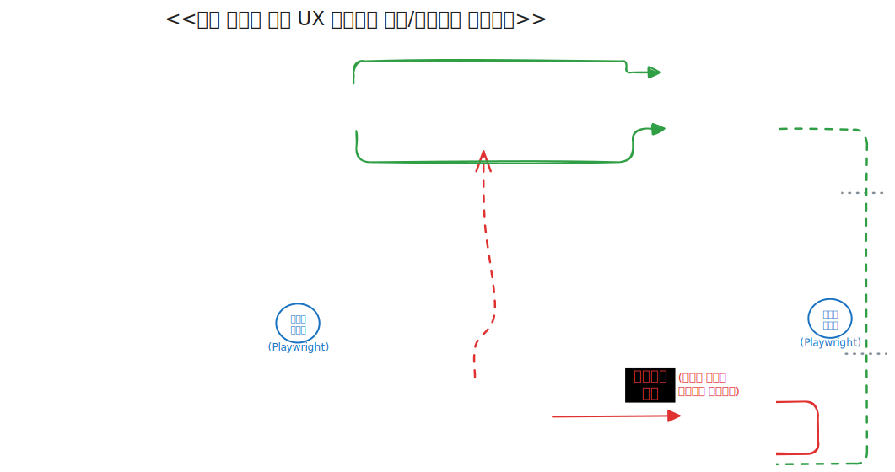
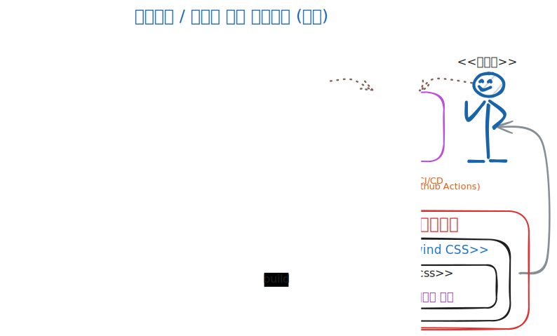

<style>

@font-face {
    font-family: 'Pretendard-Regular';
    src: url('https://fastly.jsdelivr.net/gh/Project-Noonnu/noonfonts_2107@1.1/Pretendard-Regular.woff') format('woff');
    font-weight: 400;
    font-style: normal;
}

@font-face {
    font-family: 'SUIT-Regular';
    src: url('https://fastly.jsdelivr.net/gh/projectnoonnu/noonfonts_suit@1.0/SUIT-Regular.woff2') format('woff2');
    font-weight: normal;
    font-style: normal;
}

@font-face {
    font-family: 'NanumSquareNeoLight';
    src: url(https://hangeul.pstatic.net/hangeul_static/webfont/NanumSquareNeo/NanumSquareNeoTTF-aLt.eot);
    src: url(https://hangeul.pstatic.net/hangeul_static/webfont/NanumSquareNeo/NanumSquareNeoTTF-aLt.eot?#iefix) format("embedded-opentype"), url(https://hangeul.pstatic.net/hangeul_static/webfont/NanumSquareNeo/NanumSquareNeoTTF-aLt.woff) format("woff"), url(https://hangeul.pstatic.net/hangeul_static/webfont/NanumSquareNeo/NanumSquareNeoTTF-aLt.ttf) format("truetype");
}

@font-face {
    font-family: 'NanumSquareNeo';
    src: url(https://hangeul.pstatic.net/hangeul_static/webfont/NanumSquareNeo/NanumSquareNeoTTF-bRg.eot);
    src: url(https://hangeul.pstatic.net/hangeul_static/webfont/NanumSquareNeo/NanumSquareNeoTTF-bRg.eot?#iefix) format("embedded-opentype"), url(https://hangeul.pstatic.net/hangeul_static/webfont/NanumSquareNeo/NanumSquareNeoTTF-bRg.woff) format("woff"), url(https://hangeul.pstatic.net/hangeul_static/webfont/NanumSquareNeo/NanumSquareNeoTTF-bRg.ttf) format("truetype");
}

@font-face {
    font-family: 'NanumSquareNeoBold';
    src: url(https://hangeul.pstatic.net/hangeul_static/webfont/NanumSquareNeo/NanumSquareNeoTTF-cBd.eot);
    src: url(https://hangeul.pstatic.net/hangeul_static/webfont/NanumSquareNeo/NanumSquareNeoTTF-cBd.eot?#iefix) format("embedded-opentype"), url(https://hangeul.pstatic.net/hangeul_static/webfont/NanumSquareNeo/NanumSquareNeoTTF-cBd.woff) format("woff"), url(https://hangeul.pstatic.net/hangeul_static/webfont/NanumSquareNeo/NanumSquareNeoTTF-cBd.ttf) format("truetype");
}

@font-face {
    font-family: 'NanumSquareNeoExtraBold';
    src: url(https://hangeul.pstatic.net/hangeul_static/webfont/NanumSquareNeo/NanumSquareNeoTTF-dEb.eot);
    src: url(https://hangeul.pstatic.net/hangeul_static/webfont/NanumSquareNeo/NanumSquareNeoTTF-dEb.eot?#iefix) format("embedded-opentype"), url(https://hangeul.pstatic.net/hangeul_static/webfont/NanumSquareNeo/NanumSquareNeoTTF-dEb.woff) format("woff"), url(https://hangeul.pstatic.net/hangeul_static/webfont/NanumSquareNeo/NanumSquareNeoTTF-dEb.ttf) format("truetype");
}

h1, h2 {
font-family: NanumSquareNeoExtraBold
}

p:has(img) {
   text-align: center;
}

iframe {  border: 1px solid silver; zoom: 100%; height: 100%; }

section {
  padding-top: 50px;
  user-select: none;
  font-family: NanumSquareNeo, sans-serif;
  font-size: 1.8rem;
  letter-spacing: 0.5px;
  display: flex;
  flex-direction: column;
  justify-content: start;
}
</style>


# UI/UX 표준화를 위한 <br/> DS 디자인 시스템 (DSDS) <br/>표준 컴포넌트 개발 현황

## **김용기**, 조무영 with 이재용

<{yongki82.kim, mercy.cho, jyteneo.lee}@samsung.com>

### 2025. 6. 25

---
# Agenda

**1. DSDS 표준 UI 컴포넌트 개발 개요 / 일정 /  목표**
* **개요**: DS 디자인 시스템 (DSDS)이란? 
* **목표 / 대상 / 일정**
	* **대상**: 지원 등급 (Tier 1 / 2) 에 따른 구현
	* **일정**: Tier 1 표준 구현 완료(~8/31), Vuetify 대표 화면 적용 (~9/30)

**2. 지속 가능한 UI 컴포넌트 거버넌스 및 개발 프로세스**
* 디자인 토큰 기반 디자이너 /  개발자 협업 프로세스

**3. 결론 및 향후 계획**
* 지속 가능한 프로세스 / 추가 컴포넌트 개발 필요성 / Tier 2 지원 계획

---

<style scoped> section { justify-content: center; } </style>

# 1. DSDS 표준 UI 컴포넌트 개발 개요

---
## DS 디자인 시스템 (DSDS) - 정의 및 목표

- **정의: 디자인 시스템**:
  > 웹 이나 각종 서비스 UI 디자인에서 **재사용 가능한 컴포넌트와 패턴을** 정의하여,
  > 전체 디자인에 **일관성 있게 적용**할 수 있도록 만든 **가이드라인이나 규칙**
	* UM 과제 표준: **MES향**으로 우선 구축중 (Compact / Light 모드)
		* [브래드 프로스트의 Atomic Design 방법론에](https://atomicdesign.bradfrost.com/) 기반

**목표: 지속 가능한 DSDS 컴포넌트 라이브러리 개발 체계 구축 / 적용**

* MES UM 과제(궁극적으로 전사)에서 **공통 활용할 UI 컴포넌트 라이브러리의**
* **지속 가능한** 디자이너/개발자간 **협업 프로세스 및 거버넌스 체계를** 확립하고
* (~8/31) **Tier 1 표준 구현 컴포넌트** (21개, React / Vuetify) 개발을 완료 및
* (~9/30) **2개 대표화면**(PEMS Clean Lot Dashboard, ECO Highway)에 적용.

---
#### 참고: Figma로 제작중인 DS 디자인 시스템


---
#### 참고: [DSDS UI 컴포넌트 개발 산출물 - 스토리북](https://dsds.mwebdev.samsungds.net/storybooks/react-radix-ui)

<iframe src="https://dsds.mwebdev.samsungds.net/storybooks/react-radix-ui/?path=/docs/components-buttons--docs">
</iframe>

---
### 지원 대상

DSDS 표준 UI 컴포넌트는 다음 Tier 로 지원 레벨을 나눕니다.

**[Tier 1]**
- UI 컴포넌트 개발 조직에서 개발/빌드/배포/디자인/검수 전 과정을 책임짐.
* 사내 NPM Repository 에 패키지로 배포하여 `npm install` 로 사용.
* **구현 대상:**
  - React: `@dsds/react-radix-ui` : 레퍼런스 구현
  - Vue: `@dsds/vue-vuetify` : Vuetify 스타일링 및 DS향 컴포넌트 추가
    - 기존 Vuetify 사용법과 최대한 호환: 전환 공수 절감

---
#### 참고: [DSDS UI 컴포넌트 레지스트리](https://npm.mwebdev.samsungds.net)

<iframe src="https://npm.mwebdev.samsungds.net">
</iframe>

---
#### 참고: [DSDS UI 컴포넌트 설치 방법](https://dsds.mwebdev.samsungds.net/storybooks/react-radix-ui/?path=/docs/%ED%8C%A8%ED%82%A4%EC%A7%80-%EC%82%AC%EC%9A%A9%ED%95%98%EA%B8%B0-%EC%84%A4%EC%B9%98-%EB%B0%A9%EB%B2%95--docs)

<iframe src="https://dsds.mwebdev.samsungds.net/storybooks/react-radix-ui/?path=/docs/%ED%8C%A8%ED%82%A4%EC%A7%80-%EC%82%AC%EC%9A%A9%ED%95%98%EA%B8%B0-%EC%84%A4%EC%B9%98-%EB%B0%A9%EB%B2%95--docs">
</iframe>

---

### 지원 대상 (계속)

**[Tier 2]**
- React / Vue 의 다른 UI 라이브러리 또는 JSP 등으로 구현된 레거시 웹 화면
* 개발 조직에 개발 가이드라인 제공, 컨설팅
	* 디자인 토큰 개발 개념, variables css 적용 방법, 레퍼런스 구현 사례

---

### 참고: [`@dsds/tokens` (디자인 토큰 라이브러리)](https://dsds.mwebdev.samsungds.net/storybooks/tokens)

<iframe src="https://dsds.mwebdev.samsungds.net/storybooks/tokens">
</iframe>

---
### 목표 일정

**1. [~7/31] 21개 컴포넌트 표준 구현 개발 및 디자인 토큰 배포 (진행율: 13/21, 61%)**

* **(~5/31) 기초 컴포넌트 (완료):** Buttons, Boxes (Calendar 제외), Checkbox, Dropdown, Radio, Modal, Tab, Toggle, Tooltip, Spinner
* **(~6/30) 추가 컴포넌트 (진행중):** Badge, Boxes(Calendar), Popover, Tag, Toast, Toggletip
* **(~7/31) 고급 컴포넌트 및 추가 요청사항 반영 (예정):** Header, Footer, Breadcrumbs, LNB, Comobobox, 및 추가 요구사항으로 검토된 필수 컴포넌트들 (TBD)

**2. [~8/31] 디자인 토큰 산출물을 Vue 표준 컴포넌트 라이브러리(Vuetify) 에 적용**
**3. [~9/30] MBP 신규 컨텐츠에 Vue 표준 컴포넌트 적용**
 * PEMS Clean Lot Dashboard, ECO Highway

---

<style scoped>
table { zoom: 45%; height: 100%; }
section { padding-bottom: 0px; align-items: center; }
</style>

### 표: 개발 대상 컴포넌트 목록 및 상세 진행 사항

|     상태     |  일정  |   Category    | Component               | Description                                | Level | Comment |
| :--------: | :--: | :-----------: | ----------------------- | ------------------------------------------ | ----- | ------- |
|   **완료**   | 5/31 |    Buttons    | Button                  | text, text+icon, icon                      | 기초    | 스프린트 1  |
|   **완료**   | 5/31 |     Boxes     | TextBox                 | single, multiline                          | 기초    | 스프린트 1  |
| **완료**<br> | 5/31 |   Boxes<br>   | Searchbox               | Combobox 등에 사용되는 Searchbox                 | 기초    | 스프린트 1  |
|   **완료**   | 5/31 | Dropdown Menu | Dropdown Menu+SelectBox | Dropdown 메뉴                                | 기초    | 스프린트 1  |
|   **완료**   | 5/31 |      Pop      | Modal                   | message, form                              | 기초    | 스프린트 1  |
|   **완료**   | 5/31 |      Pop      | Tooltip                 | 사용자에게 인터페이스 요소 및 특징을 떠 있는 형태의 레이어          | 기초    | 스프린트 1  |
|   **완료**   | 5/31 |   CheckBox    | CheckBox                | default (icon only), with text             | 기초    | 스프린트 1  |
|   **완료**   | 5/31 |  Radio Group  | Radio Group             | default (icon only), with text             | 기초    | 스프린트 1  |
|   **완료**   | 5/31 |      Tab      | Tab                     | default, bordered                          | 고급    | 스프린트 1  |
|   **완료**   | 6/30 |      Pop      | Toast                   | X’ icon 클릭 시 종료                            | 고급    | 스프린트 2  |
|   **완료**   | 6/30 |      Pop      | Popover                 | 부가적인 정보를 제공할 때 사용                          | 고급    | 스프린트 2  |
|   **완료**   | 6/30 |      Pop      | Toggletip               | 부가적인 정보를 제공할 때 사용                          | 고급    | 스프린트 2  |
|   **완료**   | 6/30 |     Badge     | Badge                   | notification                               | 기초    | 스프린트 2  |
|  **진행중**   | 6/30 |     Boxes     | Calbox                  | single, term (날짜 기간)                       | 고급    | 스프린트 2  |
|  **진행중**   | 6/30 |  Pagination   | Pagination              | default                                    | 기초    | 스프린트 2  |
|  **진행중**   | 6/30 |      Tag      | Tag                     | text, text+icon, text+hash                 | 기초    | 스프린트 2  |
|     예정     | 7/31 |     Boxes     | Combobox                | 검색가능한 Dropdown Menu (개발난이도로 Sprint 3에서 개발) | 고급    | 스프린트 3  |
|     예정     | 7/31 |  Navigation   | Header                  | Logo, GNB, Utility로 구성된 그룹                 | 고급    | 스프린트 3  |
|     예정     | 7/31 |  Navigation   | Footer                  | 서비스 하단에 위치                                 | 기초    | 스프린트 3  |
|     예정     | 7/31 |  Navigation   | Breadcrumbs             | 페이지 계층구조 표시                                | 기초    | 스프린트 3  |
|     예정     | 7/31 |  Navigation   | LNB                     | LNB BG 영역: 가변폭                             | 고급    | 스프린트 3  |
|     미정     | 7/31 |     Form      | Form                    | TBD (디자이너와 협의중)                            | 고급    | 스프린트 3  |

---

#### 참고: [DSDS UI 컴포넌트 개발 산출물 - 스토리북](https://dsds.mwebdev.samsungds.net/storybooks/react-radix-ui)

<iframe src="https://dsds.mwebdev.samsungds.net/storybooks/react-radix-ui">
</iframe>


---

#### 참고: [컴포넌트 개발 시작(Onboarding) 가이드](https://dsds.mwebdev.samsungds.net/storybooks/react-radix-ui/?path=/docs/%EA%B8%B0%EC%97%AC%ED%95%98%EA%B8%B0-%EA%B0%9C%EB%B0%9C-%EA%B0%80%EC%9D%B4%EB%93%9C-%EA%B8%B0%EB%B3%B8-%EA%B0%9C%EB%85%90--docs)

<iframe src="https://dsds.mwebdev.samsungds.net/storybooks/react-radix-ui/?path=/docs/%EA%B8%B0%EC%97%AC%ED%95%98%EA%B8%B0-%EA%B0%9C%EB%B0%9C-%EA%B0%80%EC%9D%B4%EB%93%9C-%EA%B8%B0%EB%B3%B8-%EA%B0%9C%EB%85%90--docs">
</iframe>

---
#### 참고: (Tier 1) 기존에 사용중인 컴포넌트 마이그레이션 전략 (Vuetify)

```diff
- import { createVuetify, VuetifyOptions } from 'vuetify'
+ import { createVuetify, VuetifyOptions } from '@dsds/vue-vuetify'

<template>
-	<v-btn variant="outlined">button</v-btn>
+	<v-btn variant="secondary">button</v-btn>
</template>
```

---

<style scoped> section { justify-content: center; } </style>

# 2. 지속가능한 UI 컴포넌트 거버넌스 및 개발 프로세스

---

## 디자이너 / 개발자 협업을 위한 표준 개발 거버넌스



---

# UI 컴포넌트 개발 거버넌스

### 중앙 집중식 거버넌스란?

- **IT UX 개발 그룹** 및 **컴포넌트 개발리더 조직이** <br/>전사 UI 컴포넌트의 개발/관리/검수를 중앙에서 전담 관리
* **타당성(Rationale)**:  **전사 UI 표준을 일관적/효율적 으로 관리 가능**
	(+ 빠른 초기 개발: *전사 어플리케이션 개발 조직의 UI 컴포넌트 기술 역량이 상이*)
* **문제점**: **지속 가능 여부** - 개발 / 검수 부하가 중앙에 집중됨
	* **해결방안**: 디자인 토큰 기반 디자이너/개발자 협업 프로세스 및 자동화 체계 구축
		* **공격적 자동화**: 가능한 모든 부분에 CI/CD 적용.
		* **테스트 첨단화**: E2E 테스트, Visual Regression 테스트 등
		* **재사용 패키지**: 가능한 모든 산출물을 패키지화

---

## 디자인 토큰 기반 디자이너/개발자 협업 프로세스



---

## 디자인 토큰 기반 디자이너/개발자 협업 프로세스

- **목적**
	- 지속 가능한, 빠르고 효율적인 디자인/개발자 업무 협업을 위한 체계 구성
* **이유**: 최소의 인력/비용으로 디자인 시스템 기반 방대한 UI 변경에 대응하기 위함.
* **방법**:
	- 디자인 토큰 기반으로 디자인의 핵심 요소 관리.
		- **디자인 토큰**: 색상, 서체, 간격 등 의미가 부여된 주요 디자인 값 및 스타일
	* CI/CD 로 디자인 토큰 변경을 코드/스토리북으로 즉시 반영
	* 디자이너 / 개발자간 소통, 재작업으로 인한 업무 LOSS 효율화

---
## 실제 개발 프로세스 (IT UX 이재용님과 협업중)

1. Figma 에서 Design Token 업데이트
2. 사내 Github Push 및 Github Actions CI/CD
   (보안 이슈 없음, 사내 네트워크 이용)
3. CSS Variables 자동 빌드 및 Storybook 퍼블리싱
4. 메신저 등으로 자동 인폼
5. CI/CD 파이프라인으로 Storybook 산출물 자동 적용

---
<style scoped>
	section { padding-top: 0px !important }
</style>


---
# 3. 결론 및 향후계획

**지속 가능한 UI/UX 개발 / 거버넌스 체계를 진지하게 고민해야 할 때**
 - **지속 가능성을 위한 도구/프로세스**
	 - 디자인 토큰의 기반의 개발 프로세스 및 디자인 자동 연동
	 - 테스트 자동화를 통한 자동 검수 커버리지 확대
	 - Storybook 을 통한 검수방식 표준화.
  - **AI 시대 정신 반영: Vibe Coding**
	 - LLM (MCP) 를 통한 UI 자동생성 / 디자인 자동 반영 기술 등

<p align="right" style="position: absolute; bottom: 80px; right: 30px; color: gray; font-style: italic"> → 추가 컴포넌트 개발 필요성 / Tier 2 지원 계획</p>


---

## 추가 컴포넌트 개발 필요성: 거버넌스 체계 수립 필요

- 현재 DSDS 개발 대상으로 선정된 컴포넌트는 기초적인 수준
* **추가 요구사항의 가능성**
	* UI App별로 추가적인 개발이 필요한 라이브러리들이 존재할 수 있음.
	* IT UX와 협업하여 이를 조사 및 검토 후 추가 개발해 나갈 예정
	* 인력 부족으로 가장 요청되는 컴포넌트 순으로 개발될 예정
* **신규 컴포넌트 개발 거버넌스 체계** 수립 필요
	* 디자인 팀을 창구로 할지, 별도 PI가 필요할지 논의 필요.

<p align="right" style="position: absolute; bottom: 80px; right: 30px; color: gray; font-style: italic"> → Tier 2 지원 계획</p>

---

## Tier 2 지원 계획

- **MES App Hub**
	* 현재 빠른 기능 개발을 위해 Publisher를 통해 별도 컴포넌트 개발중
	* 디자인 토큰이 성숙되면 디자인 토큰 라이브러리 기반으로 리팩토링 예정
* **자체 개발 / 레거시 JSP 페이지**: 표준 ESpec, 양산 PEMS 등
	- 디자인 토큰 라이브러리 사용법 기반으로 가이드 예정
	- 표준 ESpec 으로 PoC 후 양산 PEMS 및 타 시스템에 확산 예정

---

<style scoped> section { justify-content: center; } </style>

# 감사합니다.

## Q&A